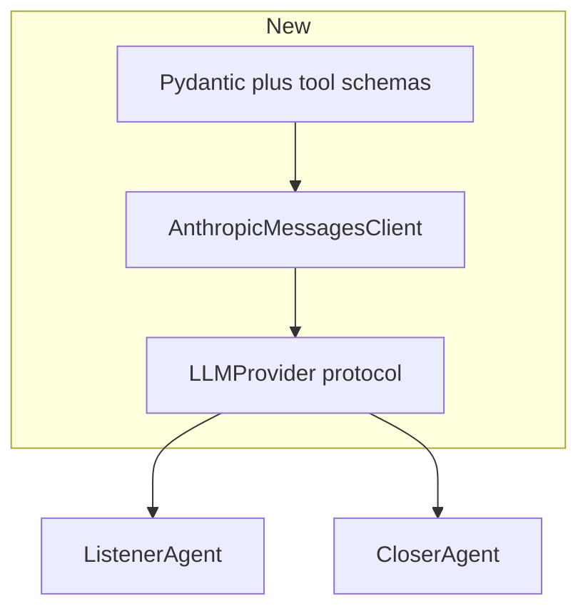

# Plan: LLM-based message parsing and reply drafting (Anthropic Claude)

## Problem

Today, “intelligence” is mostly **regex lists** in `[core/vietnamese_nlp.py](core/vietnamese_nlp.py)` and **random template filling** in `[agents/closer.py](agents/closer.py)`. That cannot reliably understand nuance, typos, mixed Vietnamese/English, implied budget, or multi-intent messages—and replies can sound hollow or invent specifics (e.g. random “percent” and “count”).

## Provider choice (locked in)

- **Vendor:** [Anthropic Messages API](https://docs.anthropic.com/en/api/messages) only—**no OpenAI API, no Codex**, no OpenAI-compatible gateway as the primary path.
- **SDK:** Official Python package `anthropic` (sync client first; async optional later if webhooks need it).
- **Default model:** **Claude Haiku** for **both** extraction and reply drafting to control cost and latency. Pin a concrete model string in config (e.g. a current Haiku snapshot from Anthropic’s docs—use env var so you can bump without code changes).
- **Optional split models (same API):** Support two env vars so you can keep Haiku for extraction and move replies to a larger Claude later **without** redesign:
  - `ANTHROPIC_MODEL_EXTRACTION` (default: Haiku)
  - `ANTHROPIC_MODEL_REPLY` (default: same as extraction)
- **Structured output strategy:** Prefer **tool use** with a single tool whose `input_schema` matches your Pydantic models (Anthropic returns structured `tool_use` input → validate with Pydantic). Alternative fallback: insist on JSON-only in the assistant text and parse + repair once; tool use is more reliable for production.

**Environment variables (document in README / `.env.example`):**

- `ANTHROPIC_API_KEY` (required when LLM path enabled)
- `ANTHROPIC_MODEL` optional single override, or use the pair above; if both patterns exist, define precedence in code (e.g. pair overrides global default).

## Target behavior

1. **Parsing:** Each customer message (with short recent history) yields a **structured update** that maps onto existing `[LeadProfile](core/models.py)` merge rules in `[agents/listener.py](agents/listener.py)`. Enum string values must match `Intent` and `InterestLevel` for downstream code.
2. **Drafting:** The Closer produces **1–N Vietnamese reply drafts** grounded in **actual customer text**, strategist `approach`, and profile—with prompts that **forbid fabricating specific listings, prices, or legal claims** until RAG/inventory exists.
3. **Operations:** Timeouts, token caps, and **graceful degradation** (heuristic fallback or partial empty extraction + logged error) when Anthropic is unreachable.

## Recommended architecture

- Implement `**LLMProvider**` in `[core/llm/provider.py](core/llm/provider.py)` with methods such as `extract_message(...)` and `generate_suggestions(...)` that internally call the Anthropic client with the right model id, `max_tokens`, and `system` + `messages` content blocks.
- **Single implementation class** (e.g. `AnthropicLLMProvider`) that wraps `anthropic.Anthropic`; keep the protocol narrow so tests inject a fake provider without network.
- **Structured extraction:** Pydantic model `MessageExtraction` (budget VND nullable, lists, enums, extras like `open_questions`, `confidence`). Map to the dict returned by `[ListenerAgent._extract_information](agents/listener.py)` so `_merge_profile` stays the single merge story.
- **Structured replies:** Tool or JSON payload → list of `{ message, tactics, reasoning_vi }` → `[Suggestion](core/models.py)`.
- **Prompting:** Vietnamese system prompts; include **last N messages** from `[ConversationHistory](core/memory.py)` (broker vs customer labels) in user content for both calls.

## Concrete code changes (by area)

| Area                                               | Action                                                                                                                                                           |
| -------------------------------------------------- | ---------------------------------------------------------------------------------------------------------------------------------------------------------------- |
| Dependencies                                       | Add `anthropic` to `[requirements.txt](requirements.txt)`; document `ANTHROPIC_*` env vars.                                                                      |
| New module                                         | `core/llm/` — `provider.py` (protocol + `AnthropicLLMProvider`), `schemas.py`, `prompts.py` or `tools.py` (tool name + schema export for extraction/replies).    |
| `[core/vietnamese_nlp.py](core/vietnamese_nlp.py)` | Retain as `**HeuristicExtractor` / fallback** only (regex budget normalization, offline tests).                                                                  |
| `[agents/listener.py](agents/listener.py)`         | Inject `LLMProvider`; `_extract_information` calls Haiku (or `ANTHROPIC_MODEL_EXTRACTION`); validate; fallback on failure.                                       |
| `[agents/closer.py](agents/closer.py)`             | Replace templates with Anthropic call; pass tactic hints from `_select_tactics` into the prompt; use reply model env.                                            |
| `[main.py](main.py)`                               | Build one `AnthropicLLMProvider` from env; pass into listener/closer; avoid new import cycles with `[integrations/zalo_routes.py](integrations/zalo_routes.py)`. |
| Tests                                              | Mock `LLMProvider`; golden Vietnamese samples; optional live test gated by `ANTHROPIC_API_KEY` + `RUN_LLM_INTEGRATION=1`.                                        |

## Guardrails

- **No fabricated inventory** (prompt + post-check: reject suggestions that assert specific unit availability if you add lint rules later).
- **PII / logging:** Do not log full transcripts at info level in production.
- **Cost / Haiku:** Set conservative `max_tokens` per call; Haiku for both tasks by default; monitor usage via Anthropic dashboard.

## Optional phase 2

- RAG for real listings.
- **Sonnet (or larger)** for replies only via `ANTHROPIC_MODEL_REPLY` while keeping Haiku for extraction.

## Success criteria

- All LLM traffic goes through **Anthropic**; no OpenAI/Codex dependency in code or docs.
- Extraction and replies are **schema-validated** and covered by mocked tests.
- Default configuration is **Claude Haiku** with clear env overrides.

## Files likely touched

- New: `core/llm/provider.py`, `core/llm/schemas.py`, optional `core/llm/prompts.py`.
- Edit: `[agents/listener.py](agents/listener.py)`, `[agents/closer.py](agents/closer.py)`, `[main.py](main.py)`, `[requirements.txt](requirements.txt)`, tests.

This keeps your three-agent orchestration and JSON storage while making parsing and drafting **actually model-driven** on **Anthropic Claude**, optimized for **Haiku-first cost**.